# Admin UI - Entity Relationship Diagram

This document presents the complete ER diagram for the Admin UI application, which manages clients, shops, and financial accounts with comprehensive document and image management capabilities.

## Pictographic Overview

```
                    🏠 ADDRESSES
                         │
        ┌────────────────┼────────────────┐
        │                │                │
    👤 CLIENTS       🏪 SHOPS        🏦 INSTITUTIONS
        │                │                │
        ├── 📄 DOCS      └── 📸 PICS      └── 💳 ACCOUNTS
        ├── 📸 PICS                           │
        └── 👥 HOLDERS ──────────────────────┤
                                             │
                                        💰 TRANSACTIONS
                                             │
                                        📋 AUDIT_LOG

    Relationship Flow:
    👤 ──owns──> 🏪 ──has──> 📸
    👤 ──holds──> 💳 ──at──> 🏦
    👤 ──has──> 📄 & 📸
    💳 ──generates──> 💰
    All changes ──logged──> 📋
```

### Entity Icons Legend
- 👤 **CLIENTS** - Individual customers
- 🏪 **SHOPS** - Business entities  
- 💳 **ACCOUNTS** - Financial accounts
- 🏦 **INSTITUTIONS** - Banks & post offices
- 🏠 **ADDRESSES** - Location data
- 💰 **TRANSACTIONS** - Financial movements
- 📄 **DOCUMENTS** - KYC & account docs
- 📸 **PROFILE_PICTURES** - Entity images
- 👥 **ACCOUNT_HOLDERS** - Account ownership
- 🤝 **SHOP_CLIENTS** - Business relationships
- 📋 **AUDIT_LOG** - Change tracking

## Visual Table Structures

### 👤 CLIENTS Table
```
┌─────────────────────────────────────────────────────────────┐
│                      👤 CLIENTS                            │
├─────────────────────────────────────────────────────────────┤
│ 🔑 id                    INTEGER PRIMARY KEY AUTOINCREMENT │
│ 📝 firstName             TEXT NOT NULL                      │
│ 📝 lastName              TEXT NOT NULL                      │
│ 📧 email                 TEXT UNIQUE                        │
│ 📞 phoneNumber           TEXT                               │
│ 📅 dateOfBirth           DATE                               │
│ 👫 gender                TEXT                               │
│ 💼 occupation            TEXT                               │
│ 🏠 addressId             INTEGER FK → ADDRESSES(id)        │
│ 🔗 linkedClientId        INTEGER FK → CLIENTS(id)          │
│ 🗑️ deletionStatus        TEXT DEFAULT 'active'             │
│ ⏰ createdAt             DATETIME DEFAULT CURRENT_TIMESTAMP │
│ 🔄 updatedAt             DATETIME DEFAULT CURRENT_TIMESTAMP │
├─────────────────────────────────────────────────────────────┤
│ 📊 INDEXES:                                                │
│   • idx_clients_email (email)                              │
│   • idx_clients_phone (phoneNumber)                        │
│   • idx_clients_address (addressId)                        │
│   • idx_clients_linked (linkedClientId)                    │
│   • idx_clients_deletion (deletionStatus)                  │
└─────────────────────────────────────────────────────────────┘
```

### 🏪 SHOPS Table
```
┌─────────────────────────────────────────────────────────────┐
│                       🏪 SHOPS                             │
├─────────────────────────────────────────────────────────────┤
│ 🔑 id                    INTEGER PRIMARY KEY AUTOINCREMENT │
│ 🏪 shopName              TEXT NOT NULL                      │
│ 🏷️ shopType              TEXT                               │
│ 📜 licenseNumber         TEXT                               │
│ 👤 ownerId               INTEGER FK → CLIENTS(id)          │
│ 🏠 addressId             INTEGER FK → ADDRESSES(id)        │
│ 🗑️ deletionStatus        TEXT DEFAULT 'active'             │
│ ⏰ createdAt             DATETIME DEFAULT CURRENT_TIMESTAMP │
│ 🔄 updatedAt             DATETIME DEFAULT CURRENT_TIMESTAMP │
├─────────────────────────────────────────────────────────────┤
│ 📊 INDEXES:                                                │
│   • idx_shops_owner (ownerId)                              │
│   • idx_shops_address (addressId)                          │
│   • idx_shops_license (licenseNumber)                      │
│   • idx_shops_deletion (deletionStatus)                    │
└─────────────────────────────────────────────────────────────┘
```

### 💳 ACCOUNTS Table
```
┌─────────────────────────────────────────────────────────────┐
│                      💳 ACCOUNTS                           │
├─────────────────────────────────────────────────────────────┤
│ 🔑 id                    INTEGER PRIMARY KEY AUTOINCREMENT │
│ 🔢 accountNumber         TEXT UNIQUE NOT NULL               │
│ 🏷️ accountType           TEXT NOT NULL                      │
│ 👥 accountOwnershipType  TEXT NOT NULL                      │
│ 💰 balance               DECIMAL DEFAULT 0.00               │
│ 📈 interestRate          DECIMAL                            │
│ 📅 maturityDate          DATE                               │
│ 🏦 institutionId         INTEGER FK → INSTITUTIONS(id)     │
│ 🗑️ deletionStatus        TEXT DEFAULT 'active'             │
│ ⏰ createdAt             DATETIME DEFAULT CURRENT_TIMESTAMP │
│ 🔄 updatedAt             DATETIME DEFAULT CURRENT_TIMESTAMP │
├─────────────────────────────────────────────────────────────┤
│ 📊 INDEXES:                                                │
│   • idx_accounts_number (accountNumber)                    │
│   • idx_accounts_type (accountType)                        │
│   • idx_accounts_institution (institutionId)              │
│   • idx_accounts_deletion (deletionStatus)                │
└─────────────────────────────────────────────────────────────┘
```

### 🏦 INSTITUTIONS Table
```
┌─────────────────────────────────────────────────────────────┐
│                    🏦 INSTITUTIONS                         │
├─────────────────────────────────────────────────────────────┤
│ 🔑 id                    INTEGER PRIMARY KEY AUTOINCREMENT │
│ 🏷️ institutionType       TEXT NOT NULL                      │
│ 🏦 institutionName       TEXT NOT NULL                      │
│ 🏢 branchCode            TEXT                               │
│ 🔢 ifscCode              TEXT                               │
│ 📮 pinCode               TEXT                               │
│ 🏠 addressId             INTEGER FK → ADDRESSES(id)        │
│ ⏰ createdAt             DATETIME DEFAULT CURRENT_TIMESTAMP │
│ 🔄 updatedAt             DATETIME DEFAULT CURRENT_TIMESTAMP │
├─────────────────────────────────────────────────────────────┤
│ 📊 INDEXES:                                                │
│   • idx_institutions_type (institutionType)               │
│   • idx_institutions_ifsc (ifscCode)                      │
│   • idx_institutions_address (addressId)                  │
└─────────────────────────────────────────────────────────────┘
```

### 🏠 ADDRESSES Table
```
┌─────────────────────────────────────────────────────────────┐
│                     🏠 ADDRESSES                           │
├─────────────────────────────────────────────────────────────┤
│ 🔑 id                    INTEGER PRIMARY KEY AUTOINCREMENT │
│ 🏠 addressLine1          TEXT NOT NULL                      │
│ 🏠 addressLine2          TEXT                               │
│ 🏠 addressLine3          TEXT                               │
│ 🏙️ city                  TEXT                               │
│ 🌍 state                 TEXT NOT NULL                      │
│ 🏙️ district              TEXT NOT NULL                      │
│ 📮 pincode               TEXT NOT NULL                      │
│ 🌎 country               TEXT NOT NULL                      │
│ ⏰ createdAt             DATETIME DEFAULT CURRENT_TIMESTAMP │
│ 🔄 updatedAt             DATETIME DEFAULT CURRENT_TIMESTAMP │
├─────────────────────────────────────────────────────────────┤
│ 📊 INDEXES:                                                │
│   • idx_addresses_pincode (pincode)                        │
│   • idx_addresses_state_district (state, district)        │
└─────────────────────────────────────────────────────────────┘
```

### 💰 TRANSACTIONS Table
```
┌─────────────────────────────────────────────────────────────┐
│                   💰 TRANSACTIONS                          │
├─────────────────────────────────────────────────────────────┤
│ 🔑 id                    INTEGER PRIMARY KEY AUTOINCREMENT │
│ 💳 accountId             INTEGER FK → ACCOUNTS(id)         │
│ 🏷️ transactionType       TEXT NOT NULL                      │
│ 💵 amount                DECIMAL NOT NULL                   │
│ 💰 balanceAfter          DECIMAL NOT NULL                   │
│ 📝 description           TEXT                               │
│ 🔢 referenceNumber       TEXT                               │
│ 📅 transactionDate       DATE NOT NULL                      │
│ ✅ status                TEXT DEFAULT 'completed'           │
│ ⏰ createdAt             DATETIME DEFAULT CURRENT_TIMESTAMP │
│ 🔄 updatedAt             DATETIME DEFAULT CURRENT_TIMESTAMP │
├─────────────────────────────────────────────────────────────┤
│ 📊 INDEXES:                                                │
│   • idx_transactions_account (accountId)                   │
│   • idx_transactions_date (transactionDate)               │
│   • idx_transactions_type (transactionType)               │
│   • idx_transactions_status (status)                      │
└─────────────────────────────────────────────────────────────┘
```

### 📸 PROFILE_PICTURES Table
```
┌─────────────────────────────────────────────────────────────┐
│                 📸 PROFILE_PICTURES                        │
├─────────────────────────────────────────────────────────────┤
│ 🔑 id                    INTEGER PRIMARY KEY AUTOINCREMENT │
│ 🏷️ entityType            TEXT NOT NULL                      │
│ 🔢 entityId              INTEGER NOT NULL                   │
│ 🖼️ imageType             TEXT NOT NULL                      │
│ 📁 fileName              TEXT NOT NULL                      │
│ 📂 filePath              TEXT NOT NULL                      │
│ 📏 fileSize              INTEGER NOT NULL                   │
│ 🎭 mimeType              TEXT NOT NULL                      │
│ ⏰ uploadedAt            DATETIME DEFAULT CURRENT_TIMESTAMP │
│ 🔄 updatedAt             DATETIME DEFAULT CURRENT_TIMESTAMP │
│ ✅ isActive              INTEGER DEFAULT 1                  │
├─────────────────────────────────────────────────────────────┤
│ 📊 INDEXES:                                                │
│   • idx_profile_pictures_entity (entityType, entityId)    │
│   • idx_profile_pictures_type (imageType)                 │
│   • idx_profile_pictures_active (isActive)                │
│ 🔒 UNIQUE: (entityType, entityId, imageType, isActive)    │
└─────────────────────────────────────────────────────────────┘
```

### 📄 DOCUMENTS Table
```
┌─────────────────────────────────────────────────────────────┐
│                     📄 DOCUMENTS                           │
├─────────────────────────────────────────────────────────────┤
│ 🔑 id                    INTEGER PRIMARY KEY AUTOINCREMENT │
│ 🏷️ entityType            TEXT NOT NULL                      │
│ 🔢 entityId              INTEGER NOT NULL                   │
│ 📋 documentType          TEXT NOT NULL                      │
│ 🔢 documentNumber        TEXT                               │
│ 📁 fileName              TEXT NOT NULL                      │
│ 📂 filePath              TEXT NOT NULL                      │
│ 📏 fileSize              INTEGER NOT NULL                   │
│ 🎭 mimeType              TEXT NOT NULL                      │
│ ⏰ uploadedAt            DATETIME DEFAULT CURRENT_TIMESTAMP │
│ 🔄 updatedAt             DATETIME DEFAULT CURRENT_TIMESTAMP │
│ 📅 expiryDate            DATE                               │
│ ✅ isVerified            INTEGER DEFAULT 0                  │
│ 🔄 isActive              INTEGER DEFAULT 1                  │
│ 👤 verifiedBy            TEXT                               │
│ ⏰ verifiedAt            DATETIME                           │
│ 📝 notes                 TEXT                               │
├─────────────────────────────────────────────────────────────┤
│ 📊 INDEXES:                                                │
│   • idx_documents_entity (entityType, entityId)           │
│   • idx_documents_type (documentType)                     │
│   • idx_documents_number (documentNumber)                 │
│   • idx_documents_verified (isVerified)                   │
│   • idx_documents_active (isActive)                       │
│   • idx_documents_expiry (expiryDate)                     │
└─────────────────────────────────────────────────────────────┘
```

### 👥 ACCOUNT_HOLDERS Table
```
┌─────────────────────────────────────────────────────────────┐
│                   👥 ACCOUNT_HOLDERS                       │
├─────────────────────────────────────────────────────────────┤
│ 🔑 id                    INTEGER PRIMARY KEY AUTOINCREMENT │
│ 💳 accountId             INTEGER FK → ACCOUNTS(id)         │
│ 👤 clientId              INTEGER FK → CLIENTS(id)          │
│ 🏷️ holderType            TEXT NOT NULL                      │
│ 📊 sharePercentage       DECIMAL                            │
│ ⏰ createdAt             DATETIME DEFAULT CURRENT_TIMESTAMP │
│ 🔄 updatedAt             DATETIME DEFAULT CURRENT_TIMESTAMP │
├─────────────────────────────────────────────────────────────┤
│ 📊 INDEXES:                                                │
│   • idx_account_holders_account (accountId)               │
│   • idx_account_holders_client (clientId)                 │
│ 🔒 UNIQUE: (accountId, clientId)                          │
└─────────────────────────────────────────────────────────────┘
```

### 🤝 SHOP_CLIENTS Table
```
┌─────────────────────────────────────────────────────────────┐
│                    🤝 SHOP_CLIENTS                         │
├─────────────────────────────────────────────────────────────┤
│ 🔑 id                    INTEGER PRIMARY KEY AUTOINCREMENT │
│ 🏪 shopId                INTEGER FK → SHOPS(id)            │
│ 👤 clientId              INTEGER FK → CLIENTS(id)          │
│ 🏷️ relationshipType      TEXT NOT NULL                      │
│ ⏰ createdAt             DATETIME DEFAULT CURRENT_TIMESTAMP │
│ 🔄 updatedAt             DATETIME DEFAULT CURRENT_TIMESTAMP │
├─────────────────────────────────────────────────────────────┤
│ 📊 INDEXES:                                                │
│   • idx_shop_clients_shop (shopId)                        │
│   • idx_shop_clients_client (clientId)                    │
│ 🔒 UNIQUE: (shopId, clientId)                             │
└─────────────────────────────────────────────────────────────┘
```

### 📋 AUDIT_LOG Table
```
┌─────────────────────────────────────────────────────────────┐
│                     📋 AUDIT_LOG                           │
├─────────────────────────────────────────────────────────────┤
│ 🔑 id                    INTEGER PRIMARY KEY AUTOINCREMENT │
│ 📊 tableName             TEXT NOT NULL                      │
│ 🔢 recordId              INTEGER NOT NULL                   │
│ 🔄 operation             TEXT NOT NULL                      │
│ 📝 oldValues             TEXT (JSON)                        │
│ 📝 newValues             TEXT (JSON)                        │
│ 👤 userId                TEXT                               │
│ ⏰ timestamp             DATETIME DEFAULT CURRENT_TIMESTAMP │
├─────────────────────────────────────────────────────────────┤
│ 📊 INDEXES:                                                │
│   • idx_audit_table_record (tableName, recordId)          │
│   • idx_audit_timestamp (timestamp)                       │
│   • idx_audit_operation (operation)                       │
└─────────────────────────────────────────────────────────────┘
```

## Entity Relationship Diagram

```mermaid
erDiagram
    ADDRESSES {
        int id PK "Auto-increment primary key"
        text addressLine1 "Primary address line"
        text addressLine2 "Secondary address line (optional)"
        text addressLine3 "Third address line (optional)"
        text state "State/Province"
        text district "District/City"
        text pincode "Postal/ZIP code"
        text country "Country"
        datetime createdAt "Auto-generated"
        datetime updatedAt "Auto-updated"
    }

    INSTITUTIONS {
        int id PK "Auto-increment primary key"
        text institutionType "bank|post_office"
        text institutionName "Name of the institution"
        text branchCode "Branch identifier"
        text ifscCode "IFSC code for banks"
        text pinCode "PIN code for post offices"
        int addressId FK "Foreign key to ADDRESSES"
        datetime createdAt "Auto-generated"
        datetime updatedAt "Auto-updated"
    }

    CLIENTS {
        int id PK "Auto-increment primary key"
        text firstName "Client's first name"
        text lastName "Client's last name"
        text email "Email address"
        text phoneNumber "Contact number"
        date dateOfBirth "Date of birth"
        text gender "Gender"
        text occupation "Occupation"
        int addressId FK "Foreign key to ADDRESSES"
        int linkedClientId FK "Self-reference for linked clients"
        text deletionStatus "active|soft_deleted|hard_deleted"
        datetime createdAt "Auto-generated"
        datetime updatedAt "Auto-updated"
    }

    SHOPS {
        int id PK "Auto-increment primary key"
        text shopName "Name of the shop"
        text shopType "Type/category of shop"
        text licenseNumber "Business license number"
        int ownerId FK "Foreign key to CLIENTS"
        int addressId FK "Foreign key to ADDRESSES"
        text deletionStatus "active|soft_deleted|hard_deleted"
        datetime createdAt "Auto-generated"
        datetime updatedAt "Auto-updated"
    }

    ACCOUNTS {
        int id PK "Auto-increment primary key"
        text accountNumber "Unique account number"
        text accountType "savings|current|fixed_deposit|recurring_deposit|loan"
        text accountOwnershipType "individual|joint|minor"
        decimal balance "Current account balance"
        decimal interestRate "Interest rate (optional)"
        date maturityDate "Maturity date for FDs/RDs (optional)"
        int institutionId FK "Foreign key to INSTITUTIONS"
        text deletionStatus "active|soft_deleted|hard_deleted"
        datetime createdAt "Auto-generated"
        datetime updatedAt "Auto-updated"
    }

    ACCOUNT_HOLDERS {
        int id PK "Auto-increment primary key"
        int accountId FK "Foreign key to ACCOUNTS"
        int clientId FK "Foreign key to CLIENTS"
        text holderType "primary|secondary|nominee"
        decimal sharePercentage "Ownership percentage"
        datetime createdAt "Auto-generated"
        datetime updatedAt "Auto-updated"
    }

    SHOP_CLIENTS {
        int id PK "Auto-increment primary key"
        int shopId FK "Foreign key to SHOPS"
        int clientId FK "Foreign key to CLIENTS"
        text relationshipType "customer|supplier|partner"
        datetime createdAt "Auto-generated"
        datetime updatedAt "Auto-updated"
    }

    TRANSACTIONS {
        int id PK "Auto-increment primary key"
        int accountId FK "Foreign key to ACCOUNTS"
        text transactionType "deposit|withdrawal|transfer|interest|fee"
        decimal amount "Transaction amount"
        decimal balanceAfter "Account balance after transaction"
        text description "Transaction description"
        text referenceNumber "Bank reference number"
        date transactionDate "Date of transaction"
        text status "completed|pending|failed|cancelled"
        datetime createdAt "Auto-generated"
        datetime updatedAt "Auto-updated"
    }

    AUDIT_LOG {
        int id PK "Auto-increment primary key"
        text tableName "Name of the affected table"
        int recordId "ID of the affected record"
        text operation "INSERT|UPDATE|DELETE|RESTORE"
        text oldValues "JSON string of old values"
        text newValues "JSON string of new values"
        text userId "User who made the change"
        datetime timestamp "When the change occurred"
    }

    PROFILE_PICTURES {
        int id PK "Auto-increment primary key"
        text entityType "client|shop|account"
        int entityId "ID of the linked entity"
        text imageType "profile|outlet|front_page"
        text fileName "Original file name"
        text filePath "Storage path to image file"
        int fileSize "File size in bytes"
        text mimeType "Image MIME type"
        datetime uploadedAt "When image was uploaded"
        datetime updatedAt "Auto-updated"
        boolean isActive "Active status (1=active, 0=inactive)"
    }

    DOCUMENTS {
        int id PK "Auto-increment primary key"
        text entityType "client|account"
        int entityId "ID of the referenced entity (client or account)"
        text documentType "pan_card|aadhar_card|passport|driving_license|voter_id|passbook_page|statement|cheque_leaf|fd_receipt|loan_document"
        text documentNumber "Official document number (PAN, Aadhar, etc.)"
        text fileName "Original uploaded file name"
        text filePath "Storage path to the document file"
        int fileSize "File size in bytes"
        text mimeType "Document format (image/jpeg, image/png, application/pdf, etc.)"
        datetime uploadedAt "When the document was uploaded"
        datetime updatedAt "Auto-updated"
        date expiryDate "Document expiry date (for passports, licenses, etc.)"
        boolean isVerified "Verification status (0 = unverified, 1 = verified)"
        boolean isActive "Soft delete flag (1 = active, 0 = deleted)"
        text verifiedBy "Who verified the document"
        datetime verifiedAt "When the document was verified"
        text notes "Additional notes about the document"
    }

    %% Relationships
    CLIENTS ||--o| ADDRESSES : "has address"
    SHOPS ||--o| ADDRESSES : "has address"
    INSTITUTIONS ||--o| ADDRESSES : "has address"
    CLIENTS ||--o| CLIENTS : "linked to (self-ref)"
    SHOPS }|--|| CLIENTS : "owned by"
    ACCOUNTS }|--|| INSTITUTIONS : "maintained at"
    ACCOUNT_HOLDERS }|--|| ACCOUNTS : "belongs to"
    ACCOUNT_HOLDERS }|--|| CLIENTS : "held by"
    SHOP_CLIENTS }|--|| SHOPS : "associated with"
    SHOP_CLIENTS }|--|| CLIENTS : "involves"
    TRANSACTIONS }|--|| ACCOUNTS : "recorded for"
    PROFILE_PICTURES }|--|| CLIENTS : "client images"
    PROFILE_PICTURES }|--|| SHOPS : "shop images"
    PROFILE_PICTURES }|--|| ACCOUNTS : "account images"
    DOCUMENTS }|--|| CLIENTS : "client documents"
    DOCUMENTS }|--|| ACCOUNTS : "account documents"
```



## Visual Data Flow

```
📊 DATA LIFECYCLE VISUALIZATION

┌─ 👤 CLIENT ONBOARDING ─────────────────────────────────────┐
│  1. 👤 Create Client → 🏠 Add Address → 📄 Upload KYC Docs │
│  2. 📸 Add Profile Picture → ✅ Verify Documents           │
└─────────────────────────────────────────────────────────────┘
                              │
┌─ 🏪 BUSINESS SETUP ─────────────────────────────────────────┐
│  3. 🏪 Create Shop → 🏠 Add Business Address               │
│  4. 📸 Add Shop Photos → 🤝 Link Shop-Client Relations     │
└─────────────────────────────────────────────────────────────┘
                              │
┌─ 💳 ACCOUNT MANAGEMENT ─────────────────────────────────────┐
│  5. 🏦 Setup Institution → 💳 Create Account               │
│  6. 👥 Add Account Holders → 📄 Upload Account Documents   │
│  7. 📸 Add Account Pictures (passbook covers, etc.)        │
└─────────────────────────────────────────────────────────────┘
                              │
┌─ 💰 TRANSACTION PROCESSING ─────────────────────────────────┐
│  8. 💰 Record Transactions → 📊 Update Balances            │
│  9. 📋 Log All Changes → 🔍 Audit Trail                    │
└─────────────────────────────────────────────────────────────┘
```

## Key Features

### Core Entities
- 👤 **CLIENTS**: Individual customers with personal information and addresses
- 🏪 **SHOPS**: Business entities owned by clients with licensing information
- 💳 **ACCOUNTS**: Financial accounts maintained at various institutions
- 🏦 **INSTITUTIONS**: Banks and post offices where accounts are held

### Supporting Entities
- 🏠 **ADDRESSES**: Normalized address storage for all entities
- 👥 **ACCOUNT_HOLDERS**: Many-to-many relationship between clients and accounts
- 🤝 **SHOP_CLIENTS**: Relationships between shops and their associated clients
- 💰 **TRANSACTIONS**: Complete financial transaction history

### Document & Media Management
- 📸 **PROFILE_PICTURES**: Image storage for clients, shops, and accounts
- 📄 **DOCUMENTS**: Document storage for KYC compliance and account management

### System Features
- 📋 **AUDIT_LOG**: Complete audit trail for all data changes
- 🗑️ **Soft Delete**: Recoverable deletion across all main entities
- 🔗 **Foreign Key Relationships**: Proper referential integrity
- ⚡ **Indexing**: Optimized query performance

## Business Rules

1. **Address Normalization**: All entities reference the ADDRESSES table
2. **Account Ownership**: Accounts can have multiple holders with defined ownership percentages
3. **Shop Ownership**: Each shop is owned by exactly one client
4. **Document Verification**: Documents have verification workflow with audit trail
5. **Image Management**: Each entity can have multiple images of different types
6. **Transaction Integrity**: All transactions maintain balance consistency
7. **Audit Trail**: All changes are logged for compliance and debugging

## Data Integrity

- Foreign key constraints ensure referential integrity
- Check constraints validate enum values and data ranges
- Unique constraints prevent duplicate critical data
- Soft delete preserves data relationships while allowing recovery
- Timestamp tracking for all create/update operations
