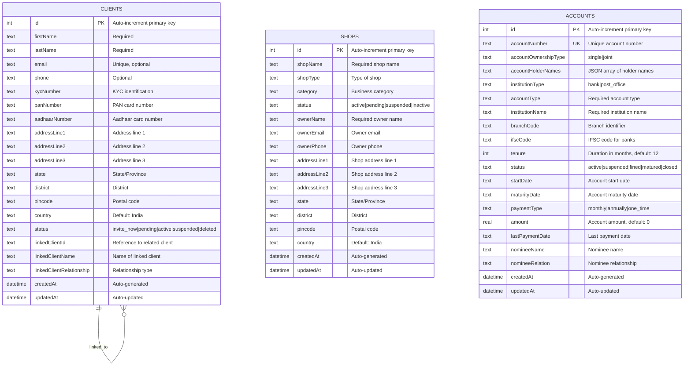

# Admin UI - Entity Relationship Diagram

## Database Schema Analysis

This ER diagram represents the data model for the Admin UI application, which manages clients, shops, and financial accounts.

## Entity Descriptions

### **CLIENTS**
- **Purpose**: Manages customer/client information
- **Key Features**:
  - Personal information (name, contact details)
  - Identity documents (KYC, PAN, Aadhaar)
  - Address information
  - Status tracking for client lifecycle
  - Self-referencing relationship for linked clients (family members, etc.)

### **SHOPS** 
- **Purpose**: Manages shop/business information
- **Key Features**:
  - Shop details (name, type, category)
  - Owner information
  - Business address
  - Status tracking for shop lifecycle
  - Independent entity with no direct relationships to other tables

### **ACCOUNTS**
- **Purpose**: Manages financial accounts (bank/post office)
- **Key Features**:
  - Account details (number, type, institution)
  - Ownership information (single/joint accounts)
  - Financial terms (tenure, amount, payment schedule)
  - Nominee information
  - Status tracking for account lifecycle
  - Independent entity with no direct foreign key relationships

## Key Observations

1. **No Foreign Key Relationships**: The current schema doesn't have explicit foreign key relationships between entities, suggesting they operate independently.

2. **Self-Referencing Client Relationship**: Clients can be linked to other clients through `linkedClientId`, `linkedClientName`, and `linkedClientRelationship` fields.

3. **JSON Storage**: Account holder names are stored as JSON arrays to support multiple holders for joint accounts.

4. **Status Management**: All entities have status fields for lifecycle management.

5. **Audit Trail**: All entities include `createdAt` and `updatedAt` timestamps.

6. **Geographic Information**: Both clients and shops store detailed address information including state, district, and pincode.

## Potential Enhancements

- **Add Relationships**: Consider adding foreign key relationships between clients and accounts, or shops and their owners
- **Normalize Data**: Extract common address information into a separate address entity
- **Add Transaction History**: Consider adding transaction or payment history tables
- **User Management**: Add user authentication and role management tables
