# Enhanced Entity Relationship Model

## Proposed Relational Database Design

This enhanced ER model introduces proper relationships, normalization, and additional entities to create a more robust data structure.

```mermaid
erDiagram
    CLIENTS {
        int id PK "Auto-increment primary key"
        text firstName "Required"
        text lastName "Required"
        text email UK "Unique email"
        text phone "Phone number"
        text kycNumber "KYC identification"
        text panNumber "PAN card number"
        text aadhaarNumber "Aadhaar card number"
        int addressId FK "Foreign key to addresses"
        text status "invite_now|pending|active|suspended|deleted"
        int linkedClientId FK "Self-referencing FK"
        text linkedClientRelationship "Relationship type"
        datetime createdAt "Auto-generated"
        datetime updatedAt "Auto-updated"
    }

    SHOPS {
        int id PK "Auto-increment primary key"
        text shopName "Required shop name"
        text shopType "Type of shop"
        text category "Business category"
        text status "active|pending|suspended|inactive"
        int ownerId FK "Foreign key to clients"
        text ownerEmail "Owner email"
        text ownerPhone "Owner phone"
        int addressId FK "Foreign key to addresses"
        datetime createdAt "Auto-generated"
        datetime updatedAt "Auto-updated"
    }

    ACCOUNTS {
        int id PK "Auto-increment primary key"
        text accountNumber UK "Unique account number"
        text accountOwnershipType "single|joint"
        text institutionType "bank|post_office"
        text accountType "Required account type"
        int institutionId FK "Foreign key to institutions"
        int tenure "Duration in months"
        text status "active|suspended|fined|matured|closed"
        date startDate "Account start date"
        date maturityDate "Account maturity date"
        text paymentType "monthly|annually|one_time"
        decimal amount "Account amount"
        date lastPaymentDate "Last payment date"
        int nomineeId FK "Foreign key to clients (nominee)"
        text nomineeRelation "Nominee relationship"
        datetime createdAt "Auto-generated"
        datetime updatedAt "Auto-updated"
    }

    ACCOUNT_HOLDERS {
        int id PK "Auto-increment primary key"
        int accountId FK "Foreign key to accounts"
        int clientId FK "Foreign key to clients"
        text holderType "primary|secondary|joint"
        datetime createdAt "Auto-generated"
    }

    ADDRESSES {
        int id PK "Auto-increment primary key"
        text addressLine1 "Address line 1"
        text addressLine2 "Address line 2"
        text addressLine3 "Address line 3"
        text state "State/Province"
        text district "District"
        text pincode "Postal code"
        text country "Default: India"
        text addressType "home|business|mailing"
        datetime createdAt "Auto-generated"
        datetime updatedAt "Auto-updated"
    }

    INSTITUTIONS {
        int id PK "Auto-increment primary key"
        text institutionName "Bank/Post Office name"
        text institutionType "bank|post_office"
        text branchCode "Branch identifier"
        text ifscCode "IFSC code for banks"
        int addressId FK "Foreign key to addresses"
        text contactPhone "Institution contact"
        text contactEmail "Institution email"
        datetime createdAt "Auto-generated"
        datetime updatedAt "Auto-updated"
    }

    TRANSACTIONS {
        int id PK "Auto-increment primary key"
        int accountId FK "Foreign key to accounts"
        text transactionType "deposit|withdrawal|interest|penalty|maturity"
        decimal amount "Transaction amount"
        date transactionDate "Date of transaction"
        text description "Transaction description"
        text status "pending|completed|failed|cancelled"
        text referenceNumber "Bank reference number"
        datetime createdAt "Auto-generated"
    }

    AUDIT_LOG {
        int id PK "Auto-increment primary key"
        text entityType "clients|shops|accounts|etc"
        int entityId "ID of the affected entity"
        text action "create|update|delete|status_change"
        text oldValues "JSON of old values"
        text newValues "JSON of new values"
        int userId "User who made the change"
        datetime timestamp "When change occurred"
    }

    %% Relationships
    CLIENTS ||--o{ CLIENTS : "linked_to"
    CLIENTS ||--o{ SHOPS : "owns"
    CLIENTS ||--o{ ACCOUNT_HOLDERS : "holds"
    CLIENTS ||--o{ ACCOUNTS : "nominee_for"
    
    SHOPS }o--|| CLIENTS : "owned_by"
    SHOPS }o--|| ADDRESSES : "located_at"
    
    ACCOUNTS ||--o{ ACCOUNT_HOLDERS : "has_holders"
    ACCOUNTS }o--|| INSTITUTIONS : "maintained_at"
    ACCOUNTS ||--o{ TRANSACTIONS : "has_transactions"
    ACCOUNTS }o--|| CLIENTS : "has_nominee"
    
    ACCOUNT_HOLDERS }o--|| CLIENTS : "belongs_to"
    ACCOUNT_HOLDERS }o--|| ACCOUNTS : "holds"
    
    ADDRESSES ||--o{ CLIENTS : "client_address"
    ADDRESSES ||--o{ SHOPS : "shop_address"
    ADDRESSES ||--o{ INSTITUTIONS : "institution_address"
    
    INSTITUTIONS ||--o{ ACCOUNTS : "maintains"
    INSTITUTIONS }o--|| ADDRESSES : "located_at"
    
    TRANSACTIONS }o--|| ACCOUNTS : "belongs_to"
```

## Enhanced Entity Descriptions

### **CLIENTS** (Enhanced)
- **Primary Entity**: Core customer information
- **Key Relationships**:
  - Self-referencing for family/linked clients
  - One-to-many with shops (as owners)
  - Many-to-many with accounts (through account_holders)
  - One-to-many with accounts (as nominees)
- **Normalized**: Address extracted to separate entity

### **SHOPS** (Enhanced)
- **Business Entity**: Shop/business information
- **Key Relationships**:
  - Many-to-one with clients (owner relationship)
  - Many-to-one with addresses (location)
- **Improvement**: Owner is now a proper FK relationship to clients

### **ACCOUNTS** (Enhanced)
- **Financial Entity**: Bank/Post Office accounts
- **Key Relationships**:
  - Many-to-one with institutions
  - Many-to-many with clients (through account_holders)
  - One-to-many with transactions
  - Many-to-one with clients (nominee)
- **Normalized**: Institution details extracted, account holders normalized

### **ACCOUNT_HOLDERS** (New Junction Table)
- **Purpose**: Manages many-to-many relationship between clients and accounts
- **Benefits**: Supports joint accounts with multiple holders
- **Fields**: Holder type (primary/secondary/joint)

### **ADDRESSES** (New Normalized Entity)
- **Purpose**: Centralized address management
- **Benefits**: Eliminates address duplication across entities
- **Supports**: Multiple address types per entity

### **INSTITUTIONS** (New Entity)
- **Purpose**: Bank and Post Office information
- **Benefits**: Normalized institution data, supports multiple branches
- **Relationships**: Has own address, maintains multiple accounts

### **TRANSACTIONS** (New Entity)
- **Purpose**: Financial transaction history
- **Benefits**: Complete audit trail of account activities
- **Types**: Deposits, withdrawals, interest, penalties, maturity

### **AUDIT_LOG** (New Entity)
- **Purpose**: System-wide change tracking
- **Benefits**: Complete audit trail for compliance
- **Tracks**: All CRUD operations across entities

## Key Improvements

### **1. Proper Relationships**
- Foreign key constraints ensure data integrity
- Junction tables support many-to-many relationships
- Self-referencing relationships properly modeled

### **2. Normalization**
- Address information centralized
- Institution details normalized
- Account holder information properly structured

### **3. Data Integrity**
- Foreign key constraints
- Unique constraints where appropriate
- Proper data types (decimal for money, date for dates)

### **4. Audit & Compliance**
- Transaction history tracking
- System-wide audit logging
- Status change tracking

### **5. Scalability**
- Support for multiple addresses per entity
- Multiple account holders per account
- Extensible transaction types

## Implementation Strategy

### **Phase 1: Core Relationships**
1. Create ADDRESSES table
2. Add foreign keys to existing tables
3. Migrate existing address data

### **Phase 2: Account Enhancement**
1. Create INSTITUTIONS table
2. Create ACCOUNT_HOLDERS junction table
3. Migrate account holder data from JSON

### **Phase 3: Transaction System**
1. Create TRANSACTIONS table
2. Implement transaction recording
3. Add financial reporting capabilities

### **Phase 4: Audit System**
1. Create AUDIT_LOG table
2. Implement triggers/middleware for change tracking
3. Add audit reporting

## Migration Considerations

- **Backward Compatibility**: Maintain existing API contracts during migration
- **Data Migration**: Scripts needed to move data to normalized structure
- **Performance**: Add appropriate indexes for new relationships
- **Testing**: Comprehensive testing of new relationships and constraints
