# Enhanced Entity Relationship Model for Admin UI

## Overview

This enhanced ER model represents an improved database design for the Admin UI application with proper relationships, normalization, and soft delete functionality. The model addresses the limitations of the current flat structure by introducing proper foreign key relationships and normalized data storage.

## Enhanced Database Schema

```mermaid
erDiagram
    CLIENTS {
        int id PK "Auto-increment primary key"
        text title "Optional"
        text firstName "Required"
        text middleName "Optional"
        text lastName "Required"
        text email "Unique, optional"
        text phone "Optional"
        text kycNumber "KYC identification"
        text panNumber "PAN card number"
        text aadhaarNumber "Aadhaar card number"
        int addressId FK "Foreign key to addresses"
        text status "invite_now|pending|active|suspended|deleted"
        int linkedClientId FK "Self-referencing FK"
        text linkedClientRelationship "Relationship type"
        boolean deletionStatus "Soft delete flag (0=active, 1=deleted)"
        datetime createdAt "Auto-generated"
        datetime updatedAt "Auto-updated"
    }

    SHOPS {
        int id PK "Auto-increment primary key"
        text shopName "Required shop name"
        text shopType "Type of shop"
        text category "Business category"
        text status "active|pending|suspended|inactive"
        int ownerId FK "Foreign key to clients (owner)"
        int addressId FK "Foreign key to addresses"
        text ownerEmail "Owner email address"
        text ownerPhone "Owner phone number"
        boolean deletionStatus "Soft delete flag (0=active, 1=deleted)"
        datetime createdAt "Auto-generated"
        datetime updatedAt "Auto-updated"
    }

    ACCOUNTS {
        int id PK "Auto-increment primary key"
        text accountNumber UK "Unique account number"
        text accountOwnershipType "single|joint"
        text accountType "Required account type"
        int institutionId FK "Foreign key to institutions"
        int tenure "Tenure in months, default 12"
        text status "active|suspended|fined|matured|closed"
        date startDate "Account start date"
        date maturityDate "Account maturity date"
        text paymentType "monthly|annually|one_time"
        decimal amount "Account amount, default 0"
        date lastPaymentDate "Last payment date"
        text nomineeName "Nominee name"
        text nomineeRelation "Nominee relationship"
        boolean deletionStatus "Soft delete flag (0=active, 1=deleted)"
        datetime createdAt "Auto-generated"
        datetime updatedAt "Auto-updated"
    }

    ADDRESSES {
        int id PK "Auto-increment primary key"
        text addressLine1 "Required address line 1"
        text addressLine2 "Optional address line 2"
        text addressLine3 "Optional address line 3"
        text state "State/Province"
        text district "District"
        text pincode "Postal code"
        text country "Default: India"
        datetime createdAt "Auto-generated"
        datetime updatedAt "Auto-updated"
    }

    INSTITUTIONS {
        int id PK "Auto-increment primary key"
        text institutionName "Required institution name"
        text institutionType "bank|post_office"
        text branchCode "Branch identifier"
        text ifscCode "IFSC code for banks"
        int addressId FK "Foreign key to addresses"
        datetime createdAt "Auto-generated"
        datetime updatedAt "Auto-updated"
    }

    ACCOUNT_HOLDERS {
        int id PK "Auto-increment primary key"
        int accountId FK "Foreign key to accounts"
        int clientId FK "Foreign key to clients"
        text holderType "primary|secondary|nominee"
        datetime addedAt "When holder was added"
    }

    SHOP_CLIENTS {
        int id PK "Auto-increment primary key"
        int shopId FK "Foreign key to shops"
        int clientId FK "Foreign key to clients"
        datetime addedAt "When client was linked to shop"
    }

    TRANSACTIONS {
        int id PK "Auto-increment primary key"
        int accountId FK "Foreign key to accounts"
        text transactionType "deposit|withdrawal|interest|penalty|maturity"
        decimal amount "Transaction amount"
        date transactionDate "Date of transaction"
        text description "Transaction description"
        text referenceNumber "Bank/PO reference number"
        text status "pending|completed|failed|cancelled"
        datetime createdAt "Auto-generated"
        datetime updatedAt "Auto-updated"
    }

    AUDIT_LOG {
        int id PK "Auto-increment primary key"
        text tableName "Table that was modified"
        int recordId "ID of the modified record"
        text operation "INSERT|UPDATE|DELETE|RESTORE"
        json oldValues "Previous values (JSON)"
        json newValues "New values (JSON)"
        text userId "User who made the change"
        datetime timestamp "When change occurred"
    }

    PROFILE_PICTURES {
        int id PK "Auto-increment primary key"
        text entityType "client|shop|account"
        int entityId "ID of the linked entity"
        text imageType "profile|outlet|front_page"
        text fileName "Original file name"
        text filePath "Storage path to image file"
        int fileSize "File size in bytes"
        text mimeType "Image MIME type"
        datetime uploadedAt "When image was uploaded"
        datetime updatedAt "Auto-updated"
        boolean isActive "Active status (1=active, 0=inactive)"
    }

    DOCUMENTS {
        int id PK "Auto-increment primary key"
        text entityType "client|account"
        int entityId "ID of the referenced entity (client or account)"
        text documentType "pan_card|aadhar_card|passport|driving_license|voter_id|passbook_page|statement|cheque_leaf|fd_receipt|loan_document"
        text documentNumber "Official document number (PAN, Aadhar, etc.)"
        text fileName "Original uploaded file name"
        text filePath "Storage path to the document file"
        int fileSize "File size in bytes"
        text mimeType "Document format (image/jpeg, image/png, application/pdf, etc.)"
        datetime uploadedAt "When the document was uploaded"
        datetime updatedAt "Auto-updated"
        date expiryDate "Document expiry date (for passports, licenses, etc.)"
        boolean isVerified "Verification status (0 = unverified, 1 = verified)"
        boolean isActive "Soft delete flag (1 = active, 0 = deleted)"
        text verifiedBy "Who verified the document"
        datetime verifiedAt "When the document was verified"
        text notes "Additional notes about the document"
    }

    %% Relationships
    CLIENTS ||--o| ADDRESSES : "has address"
    SHOPS ||--o| ADDRESSES : "has address"
    INSTITUTIONS ||--o| ADDRESSES : "has address"
    CLIENTS ||--o| CLIENTS : "linked to (self-ref)"
    SHOPS }|--|| CLIENTS : "owned by"
    ACCOUNTS }|--|| INSTITUTIONS : "maintained at"
    ACCOUNT_HOLDERS }|--|| ACCOUNTS : "belongs to"
    ACCOUNT_HOLDERS }|--|| CLIENTS : "held by"
    SHOP_CLIENTS }|--|| SHOPS : "associated with"
    SHOP_CLIENTS }|--|| CLIENTS : "includes"
    TRANSACTIONS }|--|| ACCOUNTS : "recorded for"
    PROFILE_PICTURES }|--|| CLIENTS : "client images"
    PROFILE_PICTURES }|--|| SHOPS : "shop images"
    PROFILE_PICTURES }|--|| ACCOUNTS : "account images"
    DOCUMENTS }|--|| CLIENTS : "client documents"
    DOCUMENTS }|--|| ACCOUNTS : "account documents"
```



## Enhanced Entity Descriptions

### CLIENTS (Enhanced)
**Improvements:**
- Normalized address storage via `addressId` foreign key
- Proper self-referencing relationship via `linkedClientId` foreign key
- Soft delete functionality with `deletionStatus`

### SHOPS (Enhanced)
**Improvements:**
- `ownerId` foreign key linking to CLIENTS table (shop owners are clients)
- Normalized address storage via `addressId` foreign key
- Soft delete functionality with `deletionStatus`

### ACCOUNTS (Enhanced)
**Improvements:**
- `institutionId` foreign key linking to INSTITUTIONS table
- Proper date fields instead of text
- Decimal type for monetary amounts
- Soft delete functionality with `deletionStatus`
- Account holders managed through separate junction table

### ADDRESSES (New Entity)
**Purpose:** Centralized address management
**Benefits:**
- Eliminates data duplication
- Enables address validation and standardization
- Supports address history and updates
- Shared by clients, shops, and institutions

### INSTITUTIONS (New Entity)
**Purpose:** Manages bank and post office information
**Benefits:**
- Centralizes institution data
- Enables institution-level reporting
- Supports branch management
- Proper IFSC code validation

### ACCOUNT_HOLDERS (New Junction Table)
**Purpose:** Many-to-many relationship between accounts and clients
**Benefits:**
- Supports multiple holders per account
- Tracks holder roles (primary, secondary, nominee)
- Maintains audit trail of holder changes
- Enables complex ownership structures

### SHOP_CLIENTS (Enhanced Junction Table)
**Purpose:** Many-to-many relationship between shops and clients
**Improvements:**
- Proper foreign key constraints
- Timestamp tracking

### TRANSACTIONS (New Entity)
**Purpose:** Complete transaction history for all accounts
**Benefits:**
- Full audit trail of financial activities
- Supports reconciliation and reporting
- Transaction status tracking
- Reference number management

### AUDIT_LOG (New Entity)
**Purpose:** System-wide audit trail
**Benefits:**
- Tracks all data changes
- Supports compliance requirements
- Enables data recovery
- User activity monitoring

## Key Improvements Over Current Model

### 1. Proper Normalization
- **Address Normalization:** Single ADDRESSES table shared by all entities
- **Institution Normalization:** Separate INSTITUTIONS table
- **Account Holder Normalization:** Junction table for complex ownership

### 2. Strong Referential Integrity
- All relationships enforced with foreign keys
- Cascade delete rules where appropriate
- Proper constraint validation

### 3. Enhanced Data Types
- Date fields for temporal data
- Decimal fields for monetary amounts
- JSON fields for complex data structures
- Boolean fields for flags

### 4. Comprehensive Audit Trail
- System-wide audit logging
- Complete transaction history
- Soft delete with recovery capability
- Change tracking at field level

### 5. Improved Relationships
- Shop owners are clients (eliminates data duplication)
- Multiple account holders per account
- Proper client-shop associations
- Self-referencing client relationships

## Implementation Strategy

### Phase 1: Core Structure
1. Create new normalized tables (ADDRESSES, INSTITUTIONS)
2. Add foreign key columns to existing tables
3. Migrate existing address data to ADDRESSES table
4. Create INSTITUTIONS records for existing account data

### Phase 2: Relationship Enhancement
1. Create ACCOUNT_HOLDERS junction table
2. Migrate account holder data from JSON to relational structure
3. Link shop owners to CLIENTS table
4. Establish all foreign key constraints

### Phase 3: Audit and Transaction Systems
1. Implement AUDIT_LOG table
2. Create TRANSACTIONS table
3. Set up audit triggers
4. Migrate existing transaction data (if any)

### Phase 4: Soft Delete Enhancement
1. Add `deletionStatus` to all main entities
2. Update all queries to respect soft delete
3. Implement restore functionality
4. Create deleted record management interfaces

## Migration Considerations

### Data Migration Scripts
```sql
-- Example: Migrate addresses
INSERT INTO addresses (addressLine1, addressLine2, addressLine3, state, district, pincode, country)
SELECT DISTINCT addressLine1, addressLine2, addressLine3, state, district, pincode, country 
FROM clients WHERE addressLine1 IS NOT NULL;

-- Update client records with address IDs
UPDATE clients SET addressId = (
    SELECT id FROM addresses 
    WHERE addresses.addressLine1 = clients.addressLine1 
    AND addresses.state = clients.state
    -- ... other matching criteria
);
```

### Backward Compatibility
- Maintain existing API endpoints during transition
- Implement data synchronization during migration
- Gradual rollout with feature flags
- Comprehensive testing at each phase

## API Enhancements

### New Endpoints
```
GET /api/addresses - Address management
GET /api/institutions - Institution management
GET /api/account-holders - Account holder management
GET /api/transactions - Transaction history
GET /api/audit-log - System audit trail
```

### Enhanced Existing Endpoints
```
GET /api/clients?include=address,shops,accounts
GET /api/shops?include=address,owner,clients
GET /api/accounts?include=institution,holders,transactions
```

## Benefits of Enhanced Model

1. **Data Integrity:** Foreign key constraints prevent orphaned records
2. **Reduced Redundancy:** Normalized addresses and institutions
3. **Scalability:** Proper relationships support complex queries
4. **Auditability:** Complete change tracking and transaction history
5. **Flexibility:** Support for complex business relationships
6. **Maintainability:** Clear separation of concerns
7. **Compliance:** Full audit trail for regulatory requirements
8. **Performance:** Optimized queries with proper indexing

This enhanced model provides a solid foundation for enterprise-level data management while maintaining the flexibility needed for the admin UI application's evolving requirements.
